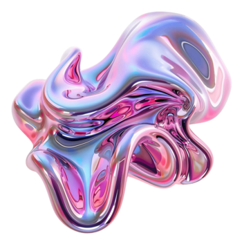
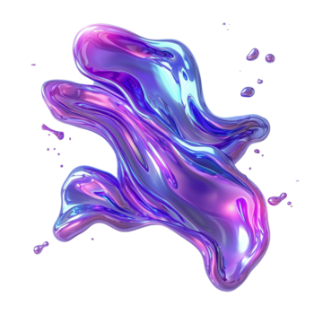
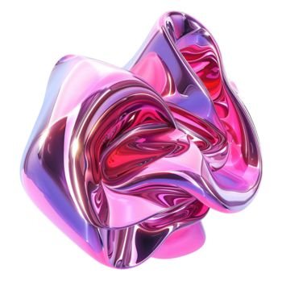
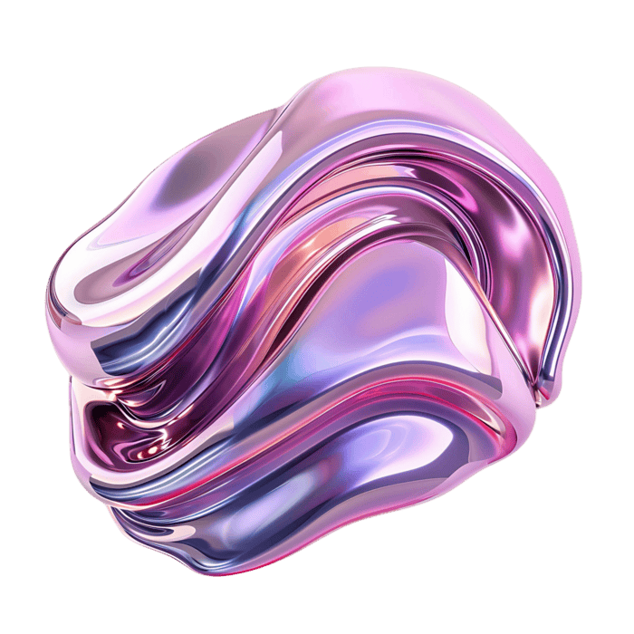

<div align="center">

<br />

```
  ██╗  ██╗ ██████╗ ██╗███╗   ██╗
  ██║ ██╔╝██╔═══██╗██║████╗  ██║
  █████╔╝ ██║   ██║██║██╔██╗ ██║
  ██╔═██╗ ██║   ██║██║██║╚██╗██║
  ██║  ██╗╚██████╔╝██║██║ ╚████║
  ╚═╝  ╚═╝ ╚═════╝ ╚═╝╚═╝  ╚═══╝
```

_The blockchain does not care about taste. We do._

<br />

</div>

---

<table>
<tr>
<td width="50%">



</td>
<td width="50%">



</td>
</tr>
<tr>
<td width="50%">



</td>
<td width="50%">



</td>
</tr>
</table>

---

<br />

## What is this

**Koin** is a curated marketplace for abstract digital entities — works that exist nowhere in the physical world and could not exist anywhere else.

Not art about technology. Art _made of_ technology. Generative systems, recursive algorithms, noise functions trained on data that has never been seen by human eyes. Each piece is a decision made by a process that learned to dream.

This is a **work in progress.** The contracts are not deployed. The auctions are not live. What you are looking at is the shape of something becoming.

<br />

## The works

The collection lives at the intersection of machine consciousness and visual entropy — abstract forms that feel ancient and synthetic at once. Chromatic fields that decay. Voids that have structure. Geometries that breathe.

Every work on Koin carries an immutable chain of custody from the moment of minting. Ownership is not a claim. It is a cryptographic fact.

<br />

## Provenance

Every work is minted once. No reprints. No editions beyond what the artist declares at the moment of creation. The contract is the certificate. The chain is the archive. When a work transfers hands, the entire history of that transfer is written permanently into a ledger that no institution controls and no government can seize.

This is what ownership looks like when it is honest.

<br />

## Curation

Koin does not index the internet. It selects.

A dedicated council of critics, collectors, and technologists reviews every artist before their first work appears on the platform. The bar is not fame. The bar is not price history. The bar is whether the work could only exist as what it is — digital, abstract, irreducible to any other medium.

Most submissions are declined. That is the point.

<br />

## Longevity

The platforms that came before us treated digital art as a file. A JPEG. Something that lives on a server someone is paying a monthly bill for.

Koin stores all metadata and media on decentralized infrastructure. The art you collect today will be retrievable in a hundred years, regardless of what happens to us. We are building for a timeline that extends past our own relevance.

<br />

## The collector

You are not buying a file. You are not buying a screenshot. You are buying a position in a cryptographic record that proves, beyond any reasonable dispute, that at a specific moment in time, a specific entity transferred a specific work to you.

What you do with that — frame it, display it, hold it, sell it — is entirely yours. The chain remembers everything. The chain forgets nothing.

<br />

## On abstraction

The works in this collection resist description. That is intentional.

Abstract art has always been the most honest form — it makes no claim about the world outside itself. It does not represent. It does not illustrate. It simply _is_, and asks you to decide what that means. In a medium built on code, abstraction becomes something stranger: the output of a system that was never told what beauty looks like, arriving at it anyway.

These are not decorations. They are arguments.

<br />

---

<div align="center">

_Something is being built here._<br />
_You found it early._

</div>
